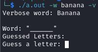
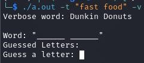
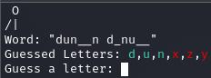

# Hangman

## Description

This is a simple hangman game written in C++. It is a command line game that allows the user to guess letters in a word. The user has 6 chances to guess the word. If the user guesses the word before the chances run out, they win. If the user runs out of chances before guessing the word, they lose.

## Installation

To install this game, run:

```sh
git clone https://github.com/321BadgerCode/hangman.git
cd ./hangman/
```

## Usage

If you're on Linux, you don't need to compile the game as there is already a `./a.out` executable file of the program in this repository. To run the game, simply run:

```sh
chmod +x ./a.out
./a.out
```

## Compile

To install this game, you will need to have a C++ compiler installed on your machine. I used the GNU Compiler Collection (GCC) to compile this game. You can download GCC [here](https://gcc.gnu.org/).

Once you have GCC installed, you can compile the game by running:

> Linux: `./a.out`
```sh
g++ ./main.cpp
```

> Windows: `.\a.exe`
```sh
g++ .\main.cpp
```

## Command Line Arguments

```
Usage: ./a.out [-w word] [-t word type] [-h] [-v] [-i]
-w word: Sets the word to guess to "word"
-t: Sets the word type to "word type"
	* "fruits": Sets the word type to fruits
	* "landmarks": Sets the word type to landmarks
	* "fast food": Sets the word type to fast food
-h: Displays this help message
-v: Displays the word to guess
-i: Displays information about the program
```

## Examples

> This image shows how `-w` allows the user to specify a word & `-v` displays the word that needs to be guessed to the user.  


> This image shows how `-t` allows the user to specify a word type.  


> This is a preview of the game. The hangman is on the top, followed by the current progress of the word to guess, and then the currently guessed letters. The user is then prompted to guess a new letter.  


## Contributing

If you would like to contribute to this project, please fork this repository and submit a pull request.

## License

